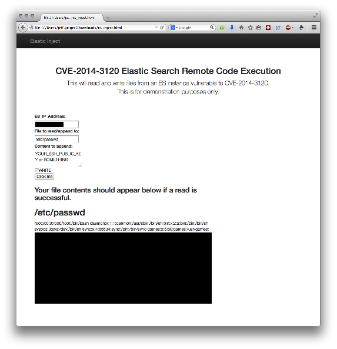

#### note: I forked to ⚙ fix multiple issues with the code as the page didn't work everything is fine now 💪
## CVE-2014-3120 Elastic Search Remote Code Execution

This project demonstrates the CVE-2014-3120 vulnerability/misconfiguration.  It allows you to read from and append to files on the system hosting ES, provided the user running ES has access to them.

### Notes

This does not require a web server.  Save it locally and run it from a browser.

Discovery and vuln publishing credit goes to: @BvdBijl - http://bouk.co/blog/elasticsearch-rce/

